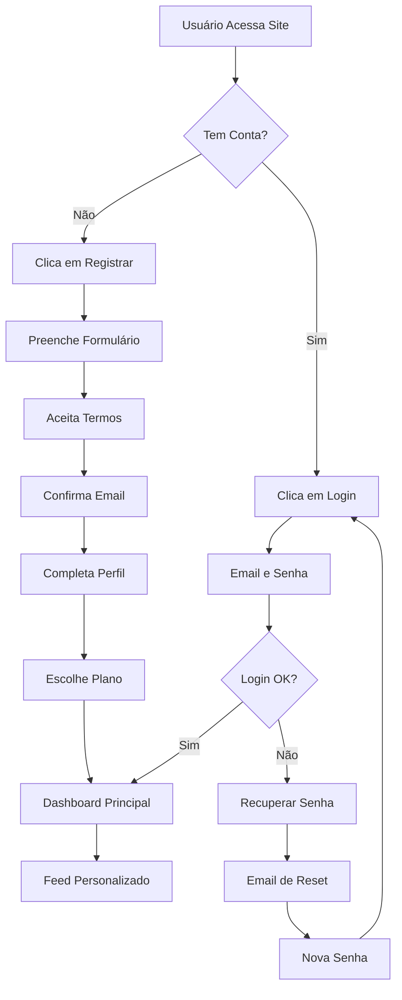
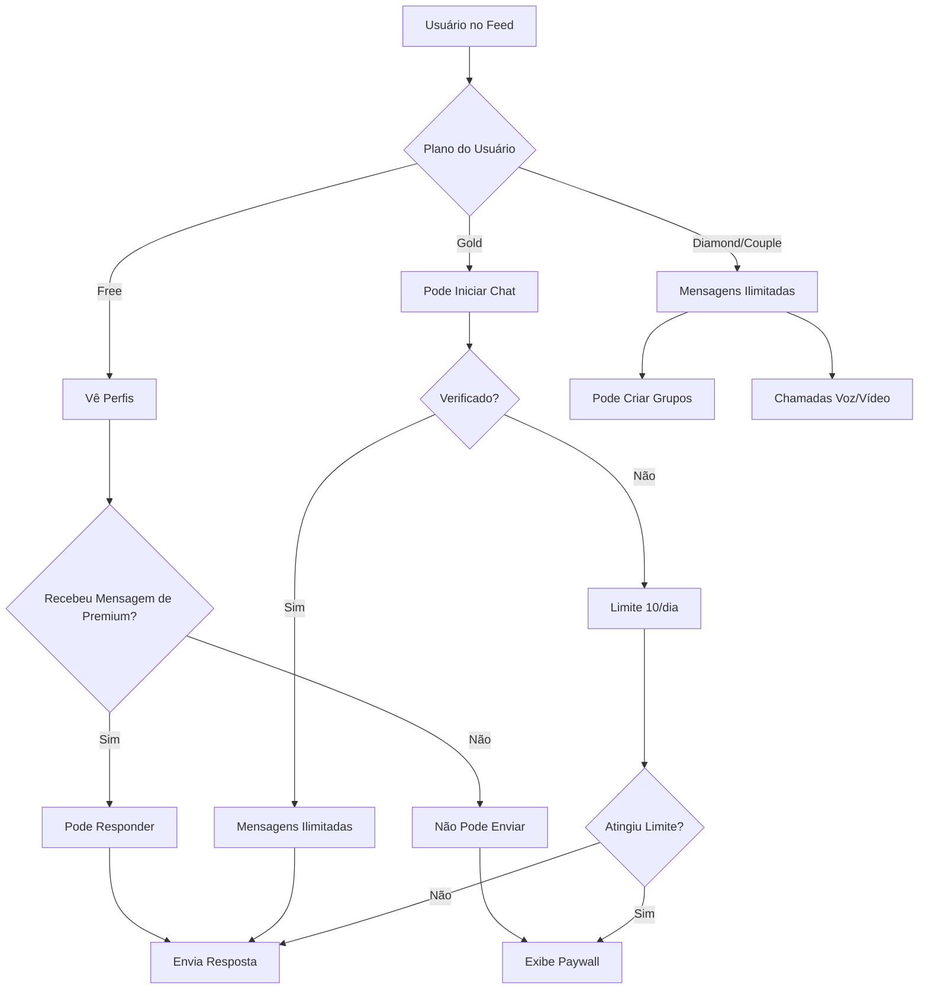
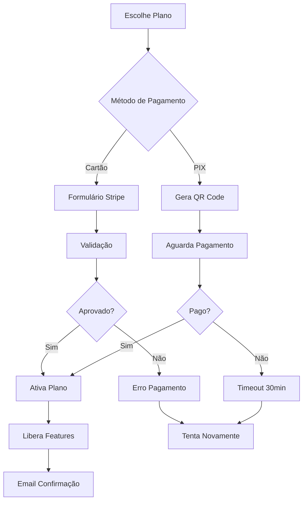
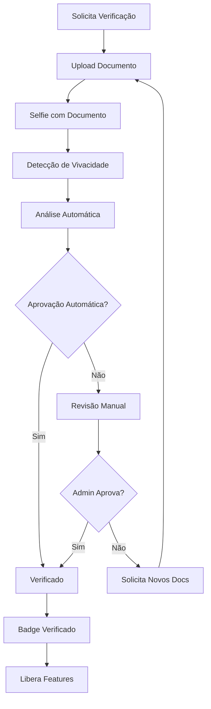
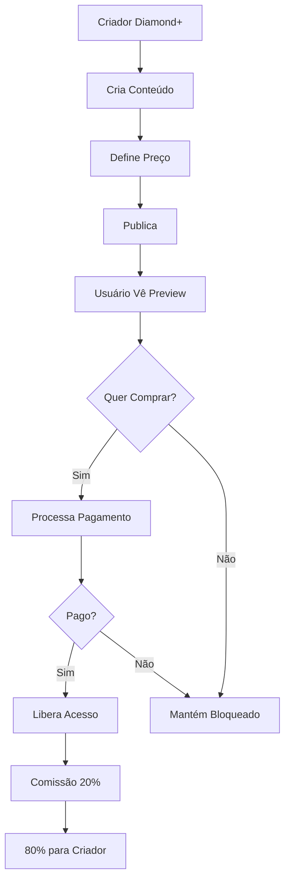

# 🌟 OpenLove - Documentação Completa v1.0

**Data de Atualização:** Janeiro 2025  
**Contato Jurídico:** juridico@openlove.com.br  
**Contato Geral:** contato@openlove.com.br  
**WhatsApp:** (41) 99503-4442

---

## 📋 Índice Geral

1. [Visão Geral](#visão-geral)
2. [Fluxogramas do Sistema](#fluxogramas-do-sistema)
3. [Regras de Negócio](#regras-de-negócio)
4. [Políticas de Compra e Assinatura](#políticas-de-compra-e-assinatura)
5. [Política de Privacidade](#política-de-privacidade)
6. [Conformidade LGPD](#conformidade-lgpd)
7. [Termos de Uso](#termos-de-uso)
8. [Política de Conteúdo e Nudez](#política-de-conteúdo-e-nudez)
9. [Monetização e Comissões](#monetização-e-comissões)
10. [Segurança e Proteção de Dados](#segurança-e-proteção-de-dados)
11. [Suporte e Atendimento](#suporte-e-atendimento)

---

## 🎯 Visão Geral

### Sobre o OpenLove

OpenLove é uma plataforma de rede social focada em conexões autênticas e relacionamentos significativos, que permite aos usuários:

- Criar e compartilhar conteúdo (texto, fotos, vídeos)
- Conectar-se com pessoas com interesses similares
- Participar de eventos e comunidades
- Monetizar conteúdo através de assinaturas e vendas
- Realizar chamadas de voz e vídeo
- Criar perfis empresariais para negócios do setor

### Missão e Valores

**Missão:** Conectar pessoas através do amor, tecnologia e experiências autênticas.

**Valores:**
- Liberdade de expressão responsável
- Privacidade e segurança dos usuários
- Inclusão e diversidade
- Inovação tecnológica
- Transparência nas relações

---

## 📊 Fluxogramas do Sistema

### 1. Fluxo de Cadastro e Onboarding

### 2. Fluxo de Mensagens

### 3. Fluxo de Pagamento

### 4. Fluxo de Verificação

### 5. Fluxo de Conteúdo Pago

---

## 📜 Regras de Negócio

### 1. Planos e Recursos

#### Plano Free
- ✅ Criar perfil básico
- ✅ Visualizar conteúdo público
- ✅ Votar em enquetes
- ✅ Responder mensagens de usuários premium
- ❌ Enviar mensagens
- ❌ Criar posts com imagens
- ❌ Participar de comunidades
- ❌ Criar eventos
- 📊 Ver anúncios a cada 5 posts

#### Plano Gold (R$ 25/mês)
- ✅ Tudo do Free +
- ✅ Enviar mensagens (10/dia não verificados, ilimitado verificados)
- ✅ Posts com até 5 imagens
- ✅ Criar eventos (3/mês não verificados, ilimitado verificados)
- ✅ Participar de comunidades (5 máximo)
- 📊 Ver anúncios a cada 10 posts

#### Plano Diamond (R$ 45/mês)
- ✅ Tudo do Gold +
- ✅ Mensagens ilimitadas
- ✅ Criar grupos de chat
- ✅ Chamadas de voz/vídeo
- ✅ Stories 24h
- ✅ Analytics do perfil
- ✅ Monetizar conteúdo
- ❌ Sem anúncios

#### Plano Couple (R$ 69,90/mês)
- ✅ Tudo do Diamond para 2 contas
- ✅ Perfil compartilhado
- ✅ Álbum privado do casal
- ✅ Diário compartilhado
- ✅ Jogos para casais

### 2. Sistema de Verificação

**Requisitos:**
- Documento oficial com foto
- Selfie segurando documento
- Detecção de vivacidade
- Aprovação em até 48h

**Benefícios:**
- Badge azul verificado
- Mais visibilidade
- Limites ampliados
- Maior confiança

### 3. Comissões e Taxas

**Vendas de Conteúdo:**
- Usuário não verificado: 20% para plataforma
- Usuário verificado: 15% para plataforma
- Business verificado: 10% para plataforma

**Processamento de Pagamento:**
- Cartão (Stripe): 2.9% + R$ 0,30
- PIX (AbacatePay): 0.99%

### 4. Limites do Sistema

**Upload de Arquivos:**
- Imagens: Máx 10MB cada
- Vídeos: Máx 100MB (Gold), 500MB (Diamond+)
- Stories: Máx 100MB

**Conteúdo:**
- Post: Máx 5000 caracteres
- Bio: Máx 500 caracteres
- Comentário: Máx 1000 caracteres

**Grupos:**
- Máx 50 membros (criados por usuários)
- Máx 500 membros (eventos)
- Máx 1000 membros (comunidades)

---

## 💳 Políticas de Compra e Assinatura

### 1. Formas de Pagamento

**Aceitas:**
- Cartões de crédito/débito (Visa, Mastercard, Elo, Amex)
- PIX
- Boleto (em breve)

**Processadores:**
- Stripe (cartões internacionais)
- AbacatePay (PIX)

### 2. Ciclos de Cobrança

- **Mensal:** Renovação automática a cada 30 dias
- **Trimestral:** 10% de desconto
- **Semestral:** 20% de desconto
- **Anual:** 30% de desconto

### 3. Política de Reembolso

**Elegível para reembolso:**
- Cobrança duplicada
- Erro técnico comprovado
- Primeiro mês se solicitado em até 7 dias

**Não elegível:**
- Após 7 dias do primeiro pagamento
- Renovações após o primeiro mês
- Conteúdo já consumido
- Violação dos Termos de Uso

### 4. Cancelamento

- Pode cancelar a qualquer momento
- Acesso mantido até fim do período pago
- Sem multas ou taxas
- Dados mantidos por 90 dias

### 5. Período de Teste

- 7 dias grátis para novos usuários
- Cartão necessário
- Cancele antes para não ser cobrado
- Um teste por CPF

---

## 🔒 Política de Privacidade

### 1. Dados Coletados

**Informações fornecidas:**
- Nome, email, telefone
- Data de nascimento
- Fotos e vídeos
- Localização (opcional)
- Preferências

**Informações automáticas:**
- Endereço IP
- Tipo de dispositivo
- Sistema operacional
- Comportamento de uso
- Cookies

### 2. Uso dos Dados

**Utilizamos seus dados para:**
- Fornecer nossos serviços
- Personalizar sua experiência
- Processar pagamentos
- Enviar comunicações
- Melhorar a plataforma
- Cumprir obrigações legais

### 3. Compartilhamento

**Compartilhamos dados com:**
- Processadores de pagamento
- Serviços de infraestrutura (AWS)
- Autoridades quando exigido por lei
- Parceiros com seu consentimento

**Nunca vendemos seus dados pessoais.**

### 4. Seus Direitos

- Acessar seus dados
- Corrigir informações
- Solicitar exclusão
- Portabilidade
- Revogar consentimento
- Limitar processamento

### 5. Segurança

- Criptografia SSL/TLS
- Senhas hasheadas
- Acesso restrito
- Monitoramento 24/7
- Backups regulares
- Conformidade PCI-DSS

---

## 📊 Conformidade LGPD

### 1. Base Legal

**Processamos dados com base em:**
- Consentimento (Art. 7º, I)
- Execução de contrato (Art. 7º, V)
- Obrigação legal (Art. 7º, II)
- Legítimo interesse (Art. 7º, IX)

### 2. Responsável pelo Tratamento

**Controlador de Dados:**
OpenLove Tecnologia Ltda.
CNPJ: XX.XXX.XXX/0001-XX
Endereço: [A definir]

**Encarregado de Dados (DPO):**
A ser nomeado
Email: privacidade@openlove.com.br

### 3. Direitos do Titular

**Você pode solicitar:**
- Confirmação de tratamento
- Acesso aos dados
- Correção de dados
- Anonimização ou bloqueio
- Portabilidade
- Eliminação
- Revogação de consentimento

**Prazo de resposta:** 15 dias úteis

### 4. Cookies e Rastreamento

**Tipos de cookies:**
- Essenciais: Funcionamento básico
- Analíticos: Melhorar experiência
- Marketing: Anúncios relevantes

**Gerenciamento:**
- Banner de consentimento
- Opt-out disponível
- Configurações granulares

### 5. Transferência Internacional

- Dados armazenados no Brasil
- Backups em conformidade
- Cláusulas contratuais padrão
- Adequação garantida

### 6. Retenção de Dados

**Períodos de retenção:**
- Conta ativa: Enquanto usar
- Conta inativa: 2 anos
- Após exclusão: 90 dias
- Logs: 6 meses
- Financeiro: 5 anos (legal)

### 7. Menores de Idade

- Proibido para menores de 18 anos
- Verificação de idade
- Exclusão imediata se descoberto
- Denúncia obrigatória de conteúdo infantil

---

## 📄 Termos de Uso

### 1. Aceitação dos Termos

Ao utilizar o OpenLove, você concorda com estes Termos de Uso. Se não concordar, não utilize nossos serviços.

### 2. Elegibilidade

**Requisitos:**
- Ter 18 anos ou mais
- Capacidade legal para contratar
- Não estar banido da plataforma
- Informações verdadeiras

### 3. Conta de Usuário

**Responsabilidades:**
- Manter senha segura
- Não compartilhar acesso
- Atualizar informações
- Notificar uso não autorizado

**Proibido:**
- Criar múltiplas contas
- Usar identidade falsa
- Vender ou transferir conta
- Automatizar ações

### 4. Conduta do Usuário

**Permitido:**
- Expressar-se livremente
- Compartilhar conteúdo adulto consensual
- Monetizar seu conteúdo
- Interagir respeitosamente

**Proibido:**
- Conteúdo ilegal
- Assédio ou bullying
- Spam ou fraude
- Violação de direitos autorais
- Conteúdo envolvendo menores
- Violência não consensual
- Discurso de ódio

### 5. Conteúdo

**Você mantém direitos sobre seu conteúdo, mas concede ao OpenLove:**
- Licença para exibir e distribuir
- Direito de moderar
- Uso para melhorias
- Armazenamento e backup

### 6. Propriedade Intelectual

**OpenLove possui:**
- Logo e marca
- Interface e design
- Código e algoritmos
- Conteúdo próprio

### 7. Limitação de Responsabilidade

OpenLove não se responsabiliza por:
- Ações de outros usuários
- Perda de dados
- Lucros cessantes
- Danos indiretos

**Limite máximo:** Valor pago nos últimos 12 meses

### 8. Indenização

Você concorda em indenizar o OpenLove por:
- Violação destes termos
- Uso indevido
- Reclamações de terceiros
- Conteúdo que postar

### 9. Modificações

- Podemos alterar os termos
- Notificação com 30 dias
- Uso continuado = aceitação
- Direito de cancelar

### 10. Rescisão

**Podemos encerrar sua conta por:**
- Violação dos termos
- Inatividade prolongada
- Ordem judicial
- Fraude ou abuso

### 11. Lei Aplicável

- Leis brasileiras
- Foro de Curitiba/PR
- Mediação preferencial
- Arbitragem opcional

---

## 🔞 Política de Conteúdo e Nudez

### 1. Princípios Gerais

O OpenLove adota uma abordagem **permissiva e adulta** em relação a conteúdo, respeitando a liberdade de expressão e a natureza adulta da plataforma.

### 2. Conteúdo Permitido

✅ **Expressamente permitido:**
- Nudez artística e erótica
- Conteúdo sexual entre adultos
- Educação sexual
- Arte e fotografia sensual
- Discussões sobre sexualidade
- Conteúdo fetichista legal
- Trabalho sexual legal

### 3. Conteúdo Proibido

❌ **Absolutamente proibido:**
- Qualquer conteúdo envolvendo menores de 18 anos
- Conteúdo sexual não consensual
- Revenge porn ou exposição não autorizada
- Zoofilia ou crueldade animal
- Necrofilia
- Violência sexual real
- Tráfico humano
- Drogas ilegais

### 4. Diretrizes de Publicação

**Conteúdo adulto deve:**
- Ser marcado como sensível
- Ter preview censurado
- Estar em áreas apropriadas
- Respeitar consentimento

**Verificação de idade:**
- Upload de conteúdo adulto requer verificação
- Visualização livre para maiores de 18
- Bloqueio automático para menores

### 5. Monetização de Conteúdo Adulto

**Permitido:**
- Venda de fotos/vídeos
- Assinaturas mensais
- Conteúdo personalizado
- Lives privadas

**Requisitos:**
- Conta verificada
- Documentação fiscal
- Termos claros
- Idade comprovada

### 6. Moderação

**Processo:**
1. Detecção automática (IA)
2. Revisão por denúncia
3. Análise humana
4. Decisão e notificação

**Apelações:**
- Prazo de 7 dias
- Revisão por equipe diferente
- Decisão final em 48h

### 7. Denúncias

**Como denunciar:**
- Botão em cada conteúdo
- Formulário detalhado
- Anonimato garantido
- Resposta em 24h

**Motivos válidos:**
- Conteúdo ilegal
- Menor de idade
- Não consensual
- Violência real
- Spam

### 8. Consequências

**Violações resultam em:**
- 1ª: Aviso e remoção
- 2ª: Suspensão 7 dias
- 3ª: Suspensão 30 dias
- 4ª: Banimento permanente

**Exceções:** Conteúdo infantil = banimento imediato + denúncia às autoridades

### 9. Proteção de Criadores

**Oferecemos:**
- Marca d'água automática
- Proteção contra screenshots (beta)
- DMCA takedown
- Suporte jurídico básico

### 10. Conteúdo Educacional

**Sempre permitido:**
- Educação sexual
- Saúde reprodutiva
- Prevenção de DSTs
- Consentimento
- Diversidade sexual

---

## 💰 Monetização e Comissões

### 1. Formas de Monetização

**Para Criadores:**
- Venda de conteúdo individual
- Assinaturas mensais
- Conteúdo personalizado
- Gorjetas (tips)
- Lives pagas
- Mensagens pagas

**Para Businesses:**
- Anúncios na plataforma
- Posts patrocinados
- Eventos pagos
- Produtos no marketplace

### 2. Estrutura de Comissões

**Criadores de Conteúdo:**
- Não verificado: 80% criador / 20% plataforma
- Verificado: 85% criador / 15% plataforma
- Verificado Diamond: 87% criador / 13% plataforma
- Top Creator (1000+ assinantes): 90% criador / 10% plataforma

**Businesses:**
- Padrão: 80% business / 20% plataforma
- Verificado: 85% business / 15% plataforma
- Parceiro: 90% business / 10% plataforma

### 3. Pagamentos

**Frequência:**
- Saldo mínimo: R$ 50
- Pagamento semanal (quinta-feira)
- PIX ou transferência bancária

**Retenções:**
- Imposto de renda conforme tabela
- Documentação fiscal obrigatória
- Emissão de nota fiscal

### 4. Sistema de Créditos

**Pacotes:**
- 100 créditos: R$ 50
- 500 créditos: R$ 200 (20% bonus)
- 1000 créditos: R$ 350 (30% bonus)
- 5000 créditos: R$ 1500 (40% bonus)

**Uso:**
- Anúncios: 10 créditos/1000 impressões
- Boost perfil: 50 créditos/dia
- Destaque evento: 100 créditos
- Mensagem em massa: 1 crédito/destinatário

---

## 🛡️ Segurança e Proteção de Dados

### 1. Medidas Técnicas

**Infraestrutura:**
- Servidores AWS com redundância
- Firewall de aplicação web (WAF)
- DDoS protection
- Backup diário criptografado
- Disaster recovery plan

**Aplicação:**
- HTTPS obrigatório
- Autenticação 2FA disponível
- Sessões com timeout
- Rate limiting
- Sanitização de inputs

### 2. Proteção de Pagamentos

**Conformidade:**
- PCI-DSS Level 1
- Tokenização de cartões
- Não armazenamos CVV
- Criptografia ponta a ponta
- Fraud detection

### 3. Privacidade

**Controles do usuário:**
- Perfil privado/público
- Bloquear usuários
- Aprovar seguidores
- Ocultar localização
- Apagar dados

### 4. Resposta a Incidentes

**Procedimento:**
1. Detecção em até 1h
2. Contenção imediata
3. Investigação completa
4. Notificação se necessário
5. Relatório pós-incidente

**Canais de reporte:**
- security@openlove.com.br
- Bug bounty program
- Formulário anônimo

### 5. Auditoria

**Frequência:**
- Pentests trimestrais
- Auditoria anual
- Logs mantidos 1 ano
- Compliance checklist mensal

---

## 📞 Suporte e Atendimento

### 1. Canais de Atendimento

**WhatsApp Business:**
- (41) 99503-4442
- Atendimento: 9h às 18h
- Resposta em até 4h

**Email:**
- Suporte: suporte@openlove.com.br
- Jurídico: juridico@openlove.com.br
- Privacidade: privacidade@openlove.com.br
- Parcerias: parcerias@openlove.com.br

**Central de Ajuda:**
- help.openlove.com.br
- FAQs atualizadas
- Tutoriais em vídeo
- Guias ilustrados

### 2. SLA (Acordo de Nível de Serviço)

**Tempo de resposta:**
- Crítico (pagamento/acesso): 2h
- Alto (funcionalidade): 8h
- Médio (dúvidas): 24h
- Baixo (sugestões): 72h

**Resolução:**
- Crítico: 4h
- Alto: 24h
- Médio: 3 dias
- Baixo: 7 dias

### 3. Processos Especiais

**Verificação de conta:**
- Análise em até 48h
- Documentos pelo app
- Suporte prioritário

**Disputas de pagamento:**
- Investigação em 5 dias
- Mediação disponível
- Decisão fundamentada

**Denúncias graves:**
- Resposta em 24h
- Ação imediata se necessário
- Acompanhamento do caso

### 4. Feedback e Melhorias

**Como contribuir:**
- Pesquisas de satisfação
- Beta testing
- Programa de embaixadores
- Sugestões recompensadas

---

## 📋 Anexos e Formulários

### Anexo A - Tabela de Preços

| Plano | Mensal | Trimestral | Semestral | Anual |
|-------|--------|------------|-----------|--------|
| Gold | R$ 25 | R$ 67,50 | R$ 120 | R$ 210 |
| Diamond | R$ 45 | R$ 121,50 | R$ 216 | R$ 378 |
| Couple | R$ 69,90 | R$ 188,73 | R$ 335,52 | R$ 587,16 |

### Anexo B - Limites por Plano

| Recurso | Free | Gold | Diamond | Couple |
|---------|------|------|---------|---------|
| Mensagens/dia | 0* | 10/∞** | ∞ | ∞ |
| Fotos/mês | 3 | 50 | ∞ | ∞ |
| Vídeos/mês | 0 | 10 | ∞ | ∞ |
| Grupos | 0 | 0 | ✓ | ✓ |
| Stories | ✗ | ✗ | ✓ | ✓ |
| Eventos/mês | 0 | 3 | ∞ | ∞ |
| Comunidades | 0 | 5 | ∞ | ∞ |

*Pode responder se receber mensagem de premium
**10 para não verificados, ilimitado para verificados

### Anexo C - Contatos de Emergência

**Violação de dados:**
- Email: security@openlove.com.br
- Telefone: 0800-XXX-XXXX

**Conteúdo ilegal:**
- Email: abuse@openlove.com.br
- Delegacia de Crimes Cibernéticos

**Imprensa:**
- Email: press@openlove.com.br
- Assessoria: (41) 99503-4442

---

## 🔄 Histórico de Revisões

| Versão | Data | Alterações |
|--------|------|------------|
| 1.0 | Jan/2025 | Documento inicial completo |

---

**OpenLove Tecnologia Ltda.**  
CNPJ: XX.XXX.XXX/0001-XX  
Todos os direitos reservados © 2025

---

*Este documento é propriedade da 55.942.611 JOAO VITOR MOITINHO. e não pode ser reproduzido sem autorização.*

