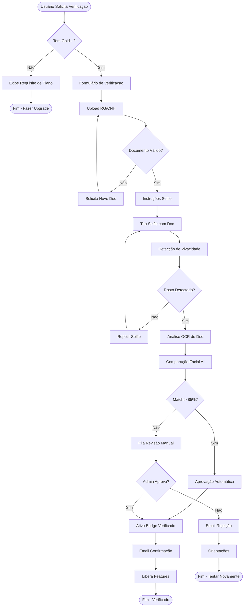
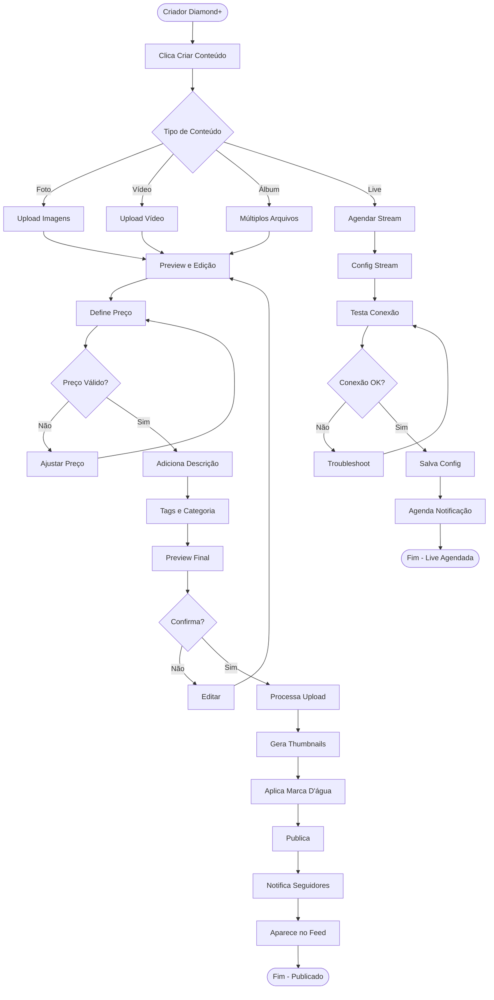
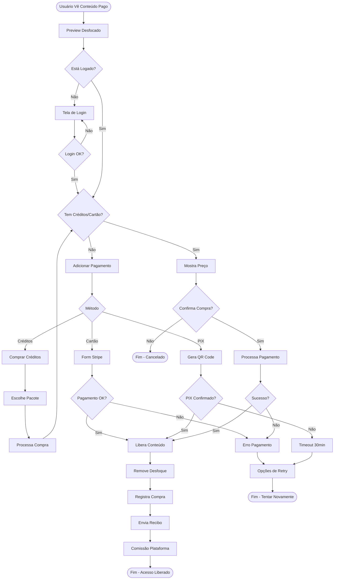
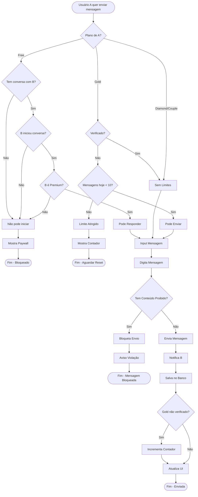
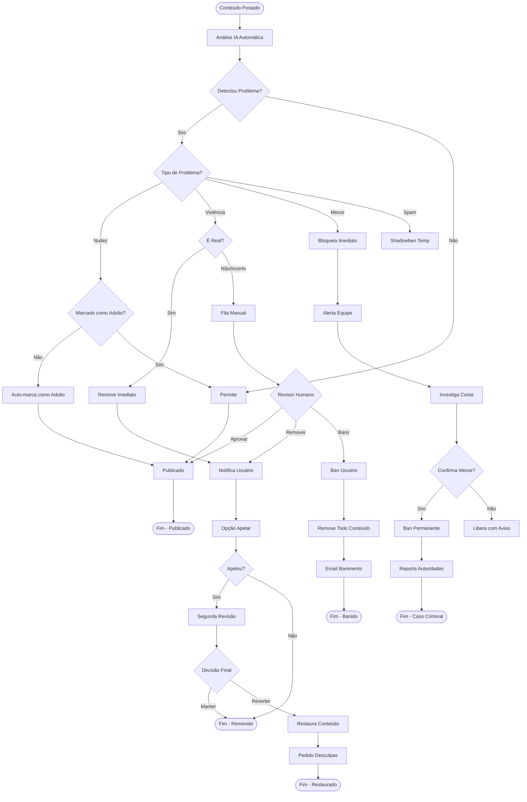
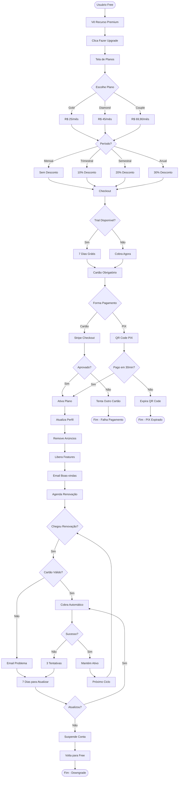
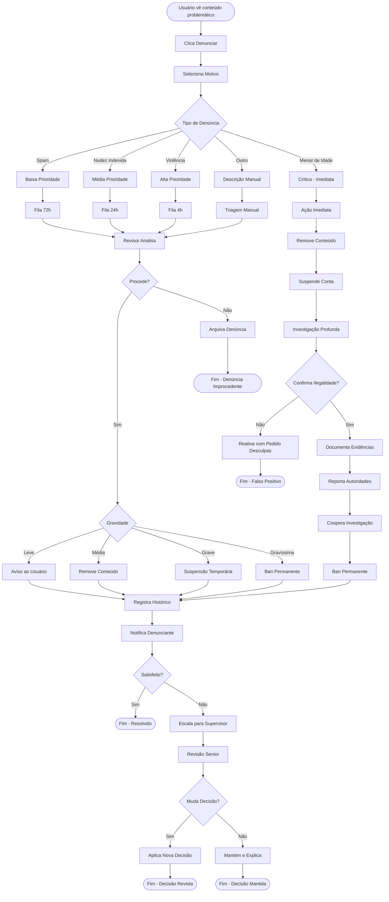
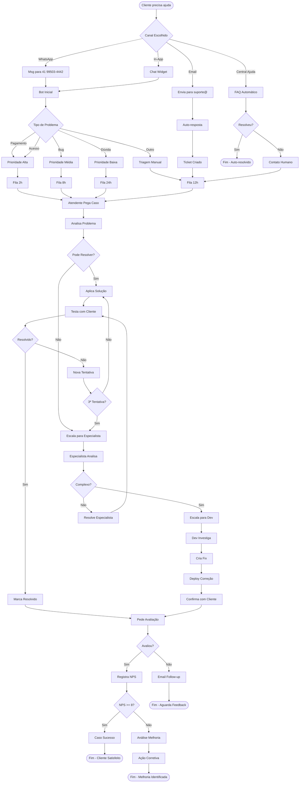

# 🔄 OpenLove - Fluxogramas Detalhados

## 1. Fluxo Completo de Verificação de Identidade

## 2. Fluxo de Criação de Conteúdo Pago

## 3. Fluxo de Compra de Conteúdo

## 4. Fluxo de Chat com Restrições

## 5. Fluxo de Moderação de Conteúdo

## 6. Fluxo de Assinatura e Renovação

## 7. Fluxo de Denúncia e Investigação

## 8. Fluxo de Suporte ao Cliente

---

## 📊 Legenda dos Fluxogramas

### Formas:
- `([...])` - Início/Fim
- `[...]` - Processo
- `{...}` - Decisão
- `((...))` - Banco de Dados
- `[/...\]` - Input Manual
- `[\...\]` - Display

### Cores (quando renderizado):
- 🟢 Verde: Fluxo positivo/sucesso
- 🔴 Vermelho: Fluxo negativo/erro
- 🟡 Amarelo: Processos de espera
- 🔵 Azul: Processos automáticos
- 🟣 Roxo: Intervenção manual

### Prioridades:
- **Crítica**: Ação imediata (< 1h)
- **Alta**: Resposta rápida (< 4h)
- **Média**: Resposta normal (< 24h)
- **Baixa**: Quando possível (< 72h)

---

*Estes fluxogramas representam os processos principais do OpenLove e devem ser atualizados conforme o sistema evolui.*