# 🔄 OpenLove - Fluxogramas Detalhados

## 1. Fluxo Completo de Verificação de Identidade

```mermaid
flowchart TD
    Start([Usuário Solicita Verificação]) --> A{Tem Gold+ ?}
    A -->|Não| B[Exibe Requisito de Plano]
    A -->|Sim| C[Formulário de Verificação]
    
    B --> End1([Fim - Fazer Upgrade])
    
    C --> D[Upload RG/CNH]
    D --> E{Documento Válido?}
    E -->|Não| F[Solicita Novo Doc]
    F --> D
    
    E -->|Sim| G[Instruções Selfie]
    G --> H[Tira Selfie com Doc]
    H --> I[Detecção de Vivacidade]
    
    I --> J{Rosto Detectado?}
    J -->|Não| K[Repetir Selfie]
    K --> H
    
    J -->|Sim| L[Análise OCR do Doc]
    L --> M[Comparação Facial AI]
    
    M --> N{Match > 85%?}
    N -->|Sim| O[Aprovação Automática]
    N -->|Não| P[Fila Revisão Manual]
    
    O --> Q[Ativa Badge Verificado]
    Q --> R[Email Confirmação]
    R --> S[Libera Features]
    S --> End2([Fim - Verificado])
    
    P --> T{Admin Aprova?}
    T -->|Sim| Q
    T -->|Não| U[Email Rejeição]
    U --> V[Orientações]
    V --> End3([Fim - Tentar Novamente])
```

## 2. Fluxo de Criação de Conteúdo Pago

```mermaid
flowchart TD
    Start([Criador Diamond+]) --> A[Clica Criar Conteúdo]
    A --> B{Tipo de Conteúdo}
    
    B -->|Foto| C[Upload Imagens]
    B -->|Vídeo| D[Upload Vídeo]
    B -->|Álbum| E[Múltiplos Arquivos]
    B -->|Live| F[Agendar Stream]
    
    C --> G[Preview e Edição]
    D --> G
    E --> G
    F --> H[Config Stream]
    
    G --> I[Define Preço]
    I --> J{Preço Válido?}
    J -->|Não| K[Ajustar Preço]
    K --> I
    
    J -->|Sim| L[Adiciona Descrição]
    L --> M[Tags e Categoria]
    M --> N[Preview Final]
    
    N --> O{Confirma?}
    O -->|Não| P[Editar]
    P --> G
    
    O -->|Sim| Q[Processa Upload]
    Q --> R[Gera Thumbnails]
    R --> S[Aplica Marca D'água]
    S --> T[Publica]
    
    T --> U[Notifica Seguidores]
    U --> V[Aparece no Feed]
    V --> End([Fim - Publicado])
    
    H --> W[Testa Conexão]
    W --> X{Conexão OK?}
    X -->|Não| Y[Troubleshoot]
    Y --> W
    X -->|Sim| Z[Salva Config]
    Z --> AA[Agenda Notificação]
    AA --> End2([Fim - Live Agendada])
```

## 3. Fluxo de Compra de Conteúdo

```mermaid
flowchart TD
    Start([Usuário Vê Conteúdo Pago]) --> A[Preview Desfocado]
    A --> B{Está Logado?}
    
    B -->|Não| C[Tela de Login]
    C --> D{Login OK?}
    D -->|Não| C
    D -->|Sim| E{Tem Créditos/Cartão?}
    
    B -->|Sim| E
    
    E -->|Não| F[Adicionar Pagamento]
    F --> G{Método}
    
    G -->|Cartão| H[Form Stripe]
    G -->|PIX| I[Gera QR Code]
    G -->|Créditos| J[Comprar Créditos]
    
    H --> K{Pagamento OK?}
    I --> L{PIX Confirmado?}
    J --> M[Escolhe Pacote]
    
    M --> N[Processa Compra]
    N --> E
    
    E -->|Sim| O[Mostra Preço]
    O --> P{Confirma Compra?}
    
    P -->|Não| End1([Fim - Cancelado])
    P -->|Sim| Q[Processa Pagamento]
    
    K -->|Sim| R[Libera Conteúdo]
    L -->|Sim| R
    K -->|Não| S[Erro Pagamento]
    L -->|Não| T[Timeout 30min]
    
    Q --> U{Sucesso?}
    U -->|Sim| R
    U -->|Não| S
    
    R --> V[Remove Desfoque]
    V --> W[Registra Compra]
    W --> X[Envia Recibo]
    X --> Y[Comissão Plataforma]
    Y --> End2([Fim - Acesso Liberado])
    
    S --> Z[Opções de Retry]
    T --> Z
    Z --> End3([Fim - Tentar Novamente])
```

## 4. Fluxo de Chat com Restrições

```mermaid
flowchart TD
    Start([Usuário A quer enviar mensagem]) --> A{Plano de A?}
    
    A -->|Free| B{Tem conversa com B?}
    B -->|Não| C[Não pode iniciar]
    C --> D[Mostra Paywall]
    D --> End1([Fim - Bloqueado])
    
    B -->|Sim| E{B iniciou conversa?}
    E -->|Não| C
    E -->|Sim| F{B é Premium?}
    F -->|Não| C
    F -->|Sim| G[Pode Responder]
    
    A -->|Gold| H{Verificado?}
    H -->|Sim| I[Sem Limites]
    H -->|Não| J{Mensagens hoje < 10?}
    J -->|Não| K[Limite Atingido]
    K --> L[Mostra Contador]
    L --> End2([Fim - Aguardar Reset])
    J -->|Sim| M[Pode Enviar]
    
    A -->|Diamond/Couple| I
    
    G --> N[Input Mensagem]
    I --> N
    M --> N
    
    N --> O[Digita Mensagem]
    O --> P{Tem Conteúdo Proibido?}
    P -->|Sim| Q[Bloqueia Envio]
    Q --> R[Aviso Violação]
    R --> End3([Fim - Mensagem Bloqueada])
    
    P -->|Não| S[Envia Mensagem]
    S --> T[Notifica B]
    T --> U[Salva no Banco]
    U --> V{Gold não verificado?}
    V -->|Sim| W[Incrementa Contador]
    W --> X[Atualiza UI]
    V -->|Não| X
    X --> End4([Fim - Enviada])
```

## 5. Fluxo de Moderação de Conteúdo

```mermaid
flowchart TD
    Start([Conteúdo Postado]) --> A[Análise IA Automática]
    A --> B{Detectou Problema?}
    
    B -->|Sim| C{Tipo de Problema?}
    C -->|Nudez| D{Marcado como Adulto?}
    D -->|Não| E[Auto-marca como Adulto]
    D -->|Sim| F[Permite]
    
    C -->|Violência| G{É Real?}
    G -->|Sim| H[Remove Imediato]
    G -->|Não/Incerto| I[Fila Manual]
    
    C -->|Menor| J[Bloqueia Imediato]
    J --> K[Alerta Equipe]
    K --> L[Investiga Conta]
    
    C -->|Spam| M[Shadowban Temp]
    
    B -->|Não| F
    
    F --> N[Publicado]
    E --> N
    
    H --> O[Notifica Usuário]
    I --> P{Revisor Humano}
    L --> Q{Confirma Menor?}
    
    P -->|Aprovar| N
    P -->|Remover| O
    P -->|Banir| R[Ban Usuário]
    
    Q -->|Sim| S[Ban Permanente]
    S --> T[Reporta Autoridades]
    Q -->|Não| U[Libera com Aviso]
    
    O --> V[Opção Apelar]
    V --> W{Apelou?}
    W -->|Sim| X[Segunda Revisão]
    W -->|Não| End1([Fim - Removido])
    
    X --> Y{Decisão Final}
    Y -->|Manter| End1
    Y -->|Reverter| Z[Restaura Conteúdo]
    Z --> AA[Pedido Desculpas]
    AA --> End2([Fim - Restaurado])
    
    R --> AB[Remove Todo Conteúdo]
    AB --> AC[Email Banimento]
    AC --> End3([Fim - Banido])
    
    N --> End4([Fim - Publicado])
    T --> End5([Fim - Caso Criminal])
```

## 6. Fluxo de Assinatura e Renovação

```mermaid
flowchart TD
    Start([Usuário Free]) --> A[Vê Recurso Premium]
    A --> B[Clica Fazer Upgrade]
    B --> C[Tela de Planos]
    
    C --> D{Escolhe Plano}
    D -->|Gold| E[R$ 25/mês]
    D -->|Diamond| F[R$ 45/mês]
    D -->|Couple| G[R$ 69,90/mês]
    
    E --> H{Período?}
    F --> H
    G --> H
    
    H -->|Mensal| I[Sem Desconto]
    H -->|Trimestral| J[10% Desconto]
    H -->|Semestral| K[20% Desconto]
    H -->|Anual| L[30% Desconto]
    
    I --> M[Checkout]
    J --> M
    K --> M
    L --> M
    
    M --> N{Trial Disponível?}
    N -->|Sim| O[7 Dias Grátis]
    N -->|Não| P[Cobra Agora]
    
    O --> Q[Cartão Obrigatório]
    P --> Q
    
    Q --> R{Forma Pagamento}
    R -->|Cartão| S[Stripe Checkout]
    R -->|PIX| T[QR Code PIX]
    
    S --> U{Aprovado?}
    T --> V{Pago em 30min?}
    
    U -->|Sim| W[Ativa Plano]
    V -->|Sim| W
    U -->|Não| X[Tenta Outro Cartão]
    V -->|Não| Y[Expira QR Code]
    
    W --> Z[Atualiza Perfil]
    Z --> AA[Remove Anúncios]
    AA --> AB[Libera Features]
    AB --> AC[Email Boas-vindas]
    
    AC --> AD[Agenda Renovação]
    AD --> AE{Chegou Renovação?}
    
    AE -->|Sim| AF{Cartão Válido?}
    AF -->|Sim| AG[Cobra Automático]
    AF -->|Não| AH[Email Problema]
    
    AG --> AI{Sucesso?}
    AI -->|Sim| AJ[Mantém Ativo]
    AI -->|Não| AK[3 Tentativas]
    
    AH --> AL[7 Dias para Atualizar]
    AK --> AL
    
    AL --> AM{Atualizou?}
    AM -->|Sim| AG
    AM -->|Não| AN[Suspende Conta]
    
    AN --> AO[Volta para Free]
    AO --> End1([Fim - Downgrade])
    
    AJ --> AP[Próximo Ciclo]
    AP --> AE
    
    X --> End2([Fim - Falha Pagamento])
    Y --> End3([Fim - PIX Expirado])
```

## 7. Fluxo de Denúncia e Investigação

```mermaid
flowchart TD
    Start([Usuário vê conteúdo problemático]) --> A[Clica Denunciar]
    A --> B[Seleciona Motivo]
    
    B --> C{Tipo de Denúncia}
    C -->|Spam| D[Baixa Prioridade]
    C -->|Nudez Indevida| E[Média Prioridade]
    C -->|Violência| F[Alta Prioridade]
    C -->|Menor de Idade| G[Crítica - Imediata]
    C -->|Outro| H[Descrição Manual]
    
    D --> I[Fila 72h]
    E --> J[Fila 24h]
    F --> K[Fila 4h]
    G --> L[Ação Imediata]
    H --> M[Triagem Manual]
    
    L --> N[Remove Conteúdo]
    N --> O[Suspende Conta]
    O --> P[Investigação Profunda]
    
    I --> Q[Revisor Analisa]
    J --> Q
    K --> Q
    M --> Q
    
    Q --> R{Procede?}
    R -->|Não| S[Arquiva Denúncia]
    R -->|Sim| T{Gravidade}
    
    T -->|Leve| U[Aviso ao Usuário]
    T -->|Média| V[Remove Conteúdo]
    T -->|Grave| W[Suspensão Temporária]
    T -->|Gravíssima| X[Ban Permanente]
    
    P --> Y{Confirma Ilegalidade?}
    Y -->|Sim| Z[Documenta Evidências]
    Y -->|Não| AA[Reativa com Pedido Desculpas]
    
    Z --> AB[Reporta Autoridades]
    AB --> AC[Coopera Investigação]
    AC --> AD[Ban Permanente]
    
    U --> AE[Registra Histórico]
    V --> AE
    W --> AE
    X --> AE
    AD --> AE
    
    AE --> AF[Notifica Denunciante]
    AF --> AG{Satisfeito?}
    
    AG -->|Sim| End1([Fim - Resolvido])
    AG -->|Não| AH[Escala para Supervisor]
    
    AH --> AI[Revisão Senior]
    AI --> AJ{Muda Decisão?}
    AJ -->|Sim| AK[Aplica Nova Decisão]
    AJ -->|Não| AL[Mantém e Explica]
    
    AK --> End2([Fim - Decisão Revista])
    AL --> End3([Fim - Decisão Mantida])
    S --> End4([Fim - Denúncia Improcedente])
    AA --> End5([Fim - Falso Positivo])
```

## 8. Fluxo de Suporte ao Cliente

```mermaid
flowchart TD
    Start([Cliente precisa ajuda]) --> A{Canal Escolhido}
    
    A -->|WhatsApp| B[Msg para 41 99503-4442]
    A -->|Email| C[Envia para suporte@]
    A -->|Central Ajuda| D[FAQ Automático]
    A -->|In-App| E[Chat Widget]
    
    B --> F[Bot Inicial]
    C --> G[Auto-resposta]
    D --> H{Resolveu?}
    E --> F
    
    F --> I{Tipo de Problema}
    G --> J[Ticket Criado]
    
    I -->|Pagamento| K[Prioridade Alta]
    I -->|Acesso| K
    I -->|Bug| L[Prioridade Média]
    I -->|Dúvida| M[Prioridade Baixa]
    I -->|Outro| N[Triagem Manual]
    
    H -->|Sim| End1([Fim - Auto-resolvido])
    H -->|Não| O[Contato Humano]
    
    K --> P[Fila 2h]
    L --> Q[Fila 8h]
    M --> R[Fila 24h]
    N --> S[Fila 12h]
    J --> S
    O --> S
    
    P --> T[Atendente Pega Caso]
    Q --> T
    R --> T
    S --> T
    
    T --> U[Analisa Problema]
    U --> V{Pode Resolver?}
    
    V -->|Sim| W[Aplica Solução]
    V -->|Não| X[Escala para Especialista]
    
    W --> Y[Testa com Cliente]
    X --> Z[Especialista Analisa]
    
    Y --> AA{Resolvido?}
    Z --> AB{Complexo?}
    
    AA -->|Sim| AC[Marca Resolvido]
    AA -->|Não| AD[Nova Tentativa]
    
    AB -->|Sim| AE[Escala para Dev]
    AB -->|Não| AF[Resolve Especialista]
    
    AD --> AG{3ª Tentativa?}
    AG -->|Não| W
    AG -->|Sim| X
    
    AE --> AH[Dev Investiga]
    AH --> AI[Cria Fix]
    AI --> AJ[Deploy Correção]
    AJ --> AK[Confirma com Cliente]
    
    AF --> Y
    
    AC --> AL[Pede Avaliação]
    AK --> AL
    
    AL --> AM{Avaliou?}
    AM -->|Sim| AN[Registra NPS]
    AM -->|Não| AO[Email Follow-up]
    
    AN --> AP{NPS >= 8?}
    AP -->|Sim| AQ[Caso Sucesso]
    AP -->|Não| AR[Análise Melhoria]
    
    AQ --> End2([Fim - Cliente Satisfeito])
    AR --> AS[Ação Corretiva]
    AS --> End3([Fim - Melhoria Identificada])
    AO --> End4([Fim - Aguarda Feedback])
```

---

## 📊 Legenda dos Fluxogramas

### Formas:
- `([...])` - Início/Fim
- `[...]` - Processo
- `{...}` - Decisão
- `((...))` - Banco de Dados
- `[/...\]` - Input Manual
- `[\...\]` - Display

### Cores (quando renderizado):
- 🟢 Verde: Fluxo positivo/sucesso
- 🔴 Vermelho: Fluxo negativo/erro
- 🟡 Amarelo: Processos de espera
- 🔵 Azul: Processos automáticos
- 🟣 Roxo: Intervenção manual

### Prioridades:
- **Crítica**: Ação imediata (< 1h)
- **Alta**: Resposta rápida (< 4h)
- **Média**: Resposta normal (< 24h)
- **Baixa**: Quando possível (< 72h)

---

*Estes fluxogramas representam os processos principais do OpenLove e devem ser atualizados conforme o sistema evolui.*