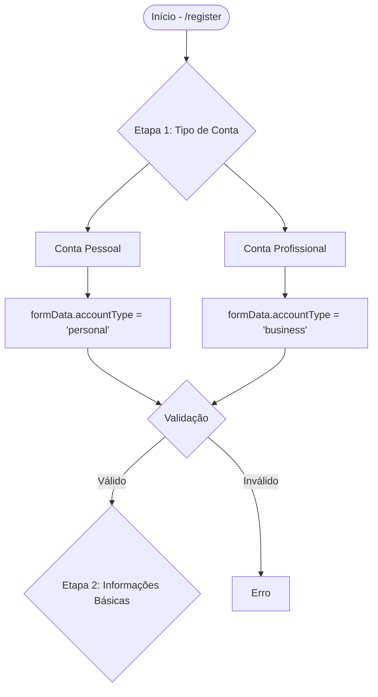

# 📋 Fluxo Completo de Registro - OpenLove

> **Última atualização:** 07/08/2025  
> **Status:** 🟡 Em análise  
> **Componente:** `components/auth/register-form.tsx`  
> **API:** `/api/v1/(auth)/register/route.ts`

## 📊 Visão Geral

O processo de registro no OpenLove é dividido em **6 etapas** progressivas, com validações client-side e server-side, integração com Supabase Auth e criação de perfil no banco de dados.

## 🔄 Fluxograma do Processo



## 📝 Detalhamento das Etapas

### **ETAPA 1: Tipo de Conta** ✅

#### Campos:
| Campo | Tipo | Obrigatório | Default | Validação |
|-------|------|-------------|---------|-----------|
| `accountType` | `"personal" \| "business"` | ✅ Sim | `"personal"` | Deve existir |

#### Estado Atual:
```typescript
interface FormData {
  accountType: "personal" | "business"
}
```

#### Comparação com Banco:
- **Frontend:** `"personal" | "business"` ✅
- **Backend:** `"personal" | "business"` ✅
- **Banco:** `ENUM ('personal', 'business')` ✅

#### Status: ✅ **CONSISTENTE**

#### Modificações Necessárias:
- *(Nenhuma até o momento)*

---

### **ETAPA 2: Informações Básicas** 🔍

#### Campos:
| Campo | Tipo | Obrigatório | Validação |
|-------|------|-------------|-----------|
| `name` | `string` | ✅ Sim | Min 2 caracteres |
| `username` | `string` | ✅ Sim | Min 3 chars, único, regex: `/^[a-zA-Z0-9_]+$/` |
| `email` | `string` | ✅ Sim | Email válido |
| `password` | `string` | ✅ Sim | Min 6 caracteres |
| `confirmPassword` | `string` | ✅ Sim | Deve coincidir com password |
| `birthDate` | `string` | ✅ Sim | Idade >= 18 anos |

#### APIs Utilizadas:
- `GET /api/v1/check-username?username={username}` - Verificação em tempo real

#### Modificações Necessárias:
- *(A ser documentado)*

---

### **ETAPA 3: Preferências do Perfil** 🔍
*Apenas para contas pessoais*

#### Campos:
| Campo | Tipo | Obrigatório | Limite |
|-------|------|-------------|--------|
| `gender` | `enum` | ✅ Sim | - |
| `lookingFor` | `string` | ✅ Sim | - |
| `profileType` | `enum` | ❌ Não | - |
| `relationshipGoals` | `string[]` | ❌ Não | Max 3 |
| `interests` | `string[]` | ❌ Não | Max 5 |

#### Modificações Necessárias:
- *(A ser documentado)*

---

### **ETAPA 4: Detalhes do Perfil** 🔍

#### Campos:
| Campo | Tipo | Obrigatório | Validação |
|-------|------|-------------|-----------|
| `profilePicture` | `File \| null` | ❌ Não | Max 5MB, JPG/PNG/WEBP |
| `bio` | `string` | ✅ Sim | Min 10 caracteres |

#### Modificações Necessárias:
- *(A ser documentado)*

---

### **ETAPA 5: Localização** 🔍

#### Campos:
| Campo | Tipo | Obrigatório | Fonte |
|-------|------|-------------|-------|
| `city` | `string` | ✅ Sim | Geolocalização/Manual |
| `state` | `string` | ❌ Não | Geolocalização |
| `uf` | `string` | ❌ Não | Geolocalização |
| `latitude` | `number \| null` | ❌ Não | Geolocalização |
| `longitude` | `number \| null` | ❌ Não | Geolocalização |

#### APIs Utilizadas:
- Browser Geolocation API
- OpenStreetMap Reverse Geocoding

#### Modificações Necessárias:
- *(A ser documentado)*

---

### **ETAPA 6: Plano e Termos** 🔍

#### Campos (Conta Pessoal):
| Campo | Tipo | Obrigatório | Opções |
|-------|------|-------------|--------|
| `plan` | `enum` | ✅ Sim | `free`, `gold`, `diamond`, `couple` |
| `termsAccepted` | `boolean` | ✅ Sim | - |
| `privacyAccepted` | `boolean` | ✅ Sim | - |

#### Modificações Necessárias:
- *(A ser documentado)*

---

## 🔄 Processo de Submissão

### 1. **Preparação dos Dados**
```typescript
const registrationData = {
  email: formData.email,
  password: formData.password,
  username: formData.username,
  name: formData.name,
  birth_date: formData.birthDate,
  account_type: formData.accountType,
  plan: formData.plan,
  // ... campos opcionais
}
```

### 2. **Chamada da API**
```typescript
POST /api/v1/(auth)/register
Content-Type: application/json
Body: registrationData
```

### 3. **Processamento Backend**
1. Validação com Zod Schema
2. Verificação de username único
3. Criação no Supabase Auth
4. Criação do perfil em `public.users`
5. (Se business) Criação em `public.businesses`
6. Retorno de sucesso/erro

### 4. **Pós-Registro**
- Auto-login com credenciais
- Upload de foto de perfil (se houver)
- Modal de pagamento (se plano pago)
- Redirecionamento:
  - Pessoal → `/feed`
  - Business → `/business/register`

---

## 🐛 Inconsistências Encontradas

### ❌ **Problemas Identificados:**

1. **Campo `gender`:**
   - Frontend: `'male' | 'female' | 'other' | 'prefer_not_to_say'`
   - Banco: `'male' | 'female' | 'non_binary' | 'other' | 'prefer_not_say'`
   - ⚠️ Falta `'non_binary'` no frontend
   - ⚠️ Diferença em `'prefer_not_to_say'` vs `'prefer_not_say'`

2. **Campo `looking_for`:**
   - Frontend: String única
   - Banco: Array `text[]`
   - ⚠️ Incompatibilidade de tipo

3. **Campos faltando:**
   - `first_name`, `last_name` (BD tem separado)
   - `country` (default 'Brazil' no BD)
   - `seeking` array
   - Configurações JSON (`privacy_settings`, `notification_settings`, `stats`)

---

## 📋 Plano de Correções

### **Prioridade Alta** 🔴
- [ ] Sincronizar ENUMs de gênero
- [ ] Corrigir tipo de `looking_for` para array
- [ ] Adicionar 'couple' no ENUM premium_type do banco

### **Prioridade Média** 🟡
- [ ] Dividir campo `name` em `first_name` e `last_name`
- [ ] Adicionar campo `country` com default
- [ ] Inicializar JSONs de configurações

### **Prioridade Baixa** 🟢
- [ ] Adicionar campos opcionais (CPF, telefone)
- [ ] Melhorar validações

---

## 📈 Métricas do Processo

- **Total de Etapas:** 6
- **Campos Coletados:** ~25
- **Validações Client-side:** 15+
- **Chamadas de API:** 8+
- **Tabelas Afetadas:** 3 (`auth.users`, `public.users`, `public.businesses`)

---

## 🔍 Status de Análise por Etapa

| Etapa | Status | Observações |
|-------|--------|-------------|
| 1. Tipo de Conta | ✅ Analisado | Consistente |
| 2. Informações Básicas | 🔍 Em análise | - |
| 3. Preferências | ⏳ Pendente | - |
| 4. Detalhes | ⏳ Pendente | - |
| 5. Localização | ⏳ Pendente | - |
| 6. Plano e Termos | ⏳ Pendente | - |

---

## 📝 Notas de Desenvolvimento

### Observações do Usuário:
*(Adicionar conforme o usuário navega pelas etapas)*

### Decisões Tomadas:
*(Documentar decisões durante a análise)*

---

**Documento em construção - Sendo atualizado conforme análise avança**