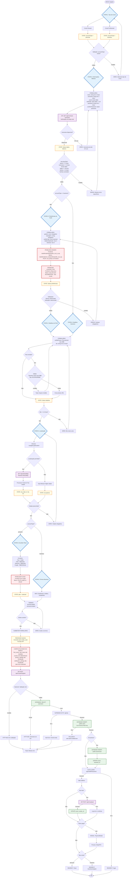

# Fluxo Completo de Registro - OpenLove

```mermaid
flowchart TD
    Start([INÍCIO /register]) --> Step1{ETAPA 1: Tipo de Conta}
    
    Step1 --> Personal[Conta Pessoal]
    Step1 --> Business[Conta Profissional]
    
    Personal --> SaveType1[STATE: accountType = personal]
    Business --> SaveType2[STATE: accountType = business]
    
    SaveType1 --> Validate1{Validação: accountType existe?}
    SaveType2 --> Validate1
    
    Validate1 -->|Válido| Step2{ETAPA 2: Informações Básicas}
    Validate1 -->|Inválido| Error1[ERRO: Selecione tipo de conta]
    Error1 --> Step1
    
    Step2 --> Form2[FORMULÁRIO:<br/>name: string min 2 chars<br/>username: string min 3 chars<br/>email: email válido<br/>birthDate: date idade >= 18<br/>password: string min 6 chars<br/>confirmPassword: match password]
    
    Form2 --> CheckUsername[API: GET /api/v1/check-username<br/>Verificação em tempo real]
    CheckUsername --> UsernameStatus{Username disponível?}
    
    UsernameStatus -->|Disponível| SaveBasic[STATE: Salvar dados básicos]
    UsernameStatus -->|Em uso| Error2[ERRO: Username já está em uso]
    Error2 --> Form2
    
    SaveBasic --> Validate2{VALIDAÇÕES:<br/>Nome >= 2 chars<br/>Username >= 3 chars<br/>Email válido<br/>Idade >= 18 anos<br/>Senha >= 6 chars<br/>Senhas coincidem}
    
    Validate2 -->|Válido| Decision1{accountType == business?}
    Validate2 -->|Inválido| Error2B[ERROS: Mostrar erros específicos]
    Error2B --> Form2
    
    Decision1 -->|Não| Step3{ETAPA 3: Preferências do Perfil}
    Decision1 -->|Sim| Step4B
    
    Step3 --> Form3[FORMULÁRIO:<br/>gender: enum obrigatório<br/>lookingFor: string obrigatório<br/>profileType: enum opcional<br/>relationshipGoals: max 3<br/>interests: max 5]
    
    Form3 --> Gender[PROBLEMA GENDER:<br/>Frontend: male/female/other/prefer_not_to_say<br/>Banco: male/female/non_binary/other/prefer_not_say<br/>FALTA: non_binary no frontend]
    
    Gender --> LookingFor[PROBLEMA LOOKING_FOR:<br/>Frontend: string única<br/>Banco: array de texto<br/>INCOMPATÍVEL: Tipo errado]
    
    LookingFor --> SavePrefs[STATE: Salvar preferências]
    
    SavePrefs --> Validate3{Validações:<br/>Gênero selecionado<br/>lookingFor selecionado}
    
    Validate3 -->|Válido| Step4
    Validate3 -->|Inválido| Error3[ERROS: Campos obrigatórios]
    Error3 --> Form3
    
    Step4{ETAPA 4: Detalhes do Perfil} --> Form4[FORMULÁRIO:<br/>profilePicture: File opcional max 5MB<br/>bio: string min 10 chars]
    
    Step4B{ETAPA 4: Detalhes Business} --> Form4
    
    Form4 --> FileCheck{Foto enviada?}
    FileCheck -->|Sim| ValidateFile{Validar:<br/>Tamanho menor que 5MB<br/>Tipo JPG/PNG/WEBP}
    FileCheck -->|Não| SaveDetails
    
    ValidateFile -->|Válido| CreatePreview[Criar preview URL]
    ValidateFile -->|Inválido| ErrorFile[Toast: Arquivo inválido]
    ErrorFile --> Form4
    
    CreatePreview --> SaveDetails[STATE: Salvar detalhes]
    
    SaveDetails --> Validate4{Bio >= 10 chars?}
    Validate4 -->|Sim| Step5
    Validate4 -->|Não| Error4[ERRO: Bio muito curta]
    Error4 --> Form4
    
    Step5{ETAPA 5: Localização} --> GeoRequest[Browser: navigator.geolocation]
    
    GeoRequest --> GeoSuccess{Localização permitida?}
    
    GeoSuccess -->|Sim| OpenStreet[API: OpenStreetMap<br/>Reverse Geocoding]
    GeoSuccess -->|Não| ManualInput[Input Manual: Digite cidade]
    
    OpenStreet --> ExtractUF[Processar: Extrair UF do estado]
    
    ExtractUF --> SaveLocation[STATE: city, state, uf, lat, lon]
    ManualInput --> SaveLocationManual[STATE: city apenas]
    
    SaveLocation --> Validate5{Cidade preenchida?}
    SaveLocationManual --> Validate5
    
    Validate5 -->|Sim| Decision2{accountType?}
    Validate5 -->|Não| Error5[ERRO: Cidade obrigatória]
    Error5 --> Step5
    
    Decision2 -->|personal| Step6P{ETAPA 6: Escolher Plano}
    Decision2 -->|business| Step6B{ETAPA 6: Termos Business}
    
    Step6P --> Plans[PLANOS:<br/>Free - Grátis<br/>Gold - R$25/mês<br/>Diamond - R$45/mês<br/>Couple - R$69.90/mês]
    
    Plans --> PlanProblem[PROBLEMA PLANO:<br/>Frontend: tem couple<br/>Banco: FALTA couple no ENUM]
    
    PlanProblem --> SavePlan[STATE: plan = selected]
    
    Step6B --> BusinessInfo[INFO: Dashboard, créditos, campanhas]
    
    SavePlan --> Terms
    BusinessInfo --> Terms
    
    Terms[TERMOS:<br/>termsAccepted<br/>privacyAccepted] --> ValidateTerms{Ambos aceitos?}
    
    ValidateTerms -->|Sim| Submit[SUBMETER FORMULÁRIO]
    ValidateTerms -->|Não| Error6[ERRO: Aceite os termos]
    Error6 --> Terms
    
    Submit --> PrepareData[PREPARAR DADOS:<br/>Converter para snake_case<br/>Formato API]
    
    PrepareData --> MissingFields[CAMPOS FALTANDO NO BANCO:<br/>first_name / last_name não divididos<br/>country sem default Brazil<br/>privacy_settings não inicializado<br/>notification_settings não inicializado<br/>stats não inicializado]
    
    MissingFields --> APIRegister[API POST: /api/v1/auth/register]
    
    APIRegister --> ValidateAPI{Backend: Validação Zod}
    
    ValidateAPI -->|Inválido| APIError[HTTP 400: Erro validação]
    APIError --> ShowError[Toast: Mostrar erro]
    
    ValidateAPI -->|Válido| CheckUserDB[DATABASE: SELECT username]
    
    CheckUserDB -->|Existe| APIError2[HTTP 400: Username em uso]
    APIError2 --> ShowError
    
    CheckUserDB -->|Livre| CreateAuth[SUPABASE AUTH: signUp]
    
    CreateAuth -->|Erro| AuthError[Auth Error: Email existe]
    AuthError --> ShowError
    
    CreateAuth -->|Sucesso| CreateProfile[DATABASE INSERT: public.users<br/>Com Service Role Key]
    
    CreateProfile -->|Erro| Rollback[ROLLBACK: auth.admin.deleteUser]
    Rollback --> ShowError
    
    CreateProfile -->|Sucesso| CheckBusinessType{É business?}
    
    CheckBusinessType -->|Sim| CreateBusiness[DATABASE INSERT: public.businesses]
    CheckBusinessType -->|Não| AutoLogin
    
    CreateBusiness --> UpdateUser[UPDATE users: business_id]
    
    UpdateUser --> AutoLogin[AUTO LOGIN: signInWithPassword]
    
    AutoLogin -->|Erro| RedirectLogin[REDIRECT: /login]
    
    AutoLogin -->|Sucesso| WaitSession[Wait 1000ms]
    
    WaitSession --> UploadPhoto{Tem foto?}
    
    UploadPhoto -->|Sim| UploadAPI[API POST: /api/v1/upload]
    UploadPhoto -->|Não| CheckPlan
    
    UploadAPI -->|Sucesso| UpdateAvatar[UPDATE users: avatar_url]
    UploadAPI -->|Erro| IgnoreError[Log error e continua]
    
    UpdateAvatar --> CheckPlan
    IgnoreError --> CheckPlan
    
    CheckPlan{Plano pago?}
    CheckPlan -->|Sim| PaymentModal[MODAL: PaymentModal]
    CheckPlan -->|Não| FinalRedirect
    
    PaymentModal --> ProcessPayment[Process: Stripe/PIX]
    
    ProcessPayment --> FinalRedirect{Tipo conta?}
    
    FinalRedirect -->|personal| RedirectFeed[REDIRECT: /feed]
    FinalRedirect -->|business| RedirectBusiness[REDIRECT: /business/register]
    
    RedirectFeed --> End([FIM])
    RedirectBusiness --> End
    RedirectLogin --> End
    
    classDef etapa fill:#e3f2fd,stroke:#1565c0,stroke-width:3px
    classDef problema fill:#ffebee,stroke:#c62828,stroke-width:3px
    classDef api fill:#f3e5f5,stroke:#6a1b9a,stroke-width:2px
    classDef banco fill:#e8f5e9,stroke:#2e7d32,stroke-width:2px
    classDef state fill:#fffde7,stroke:#f57f17,stroke-width:2px
    
    class Step1,Step2,Step3,Step4,Step4B,Step5,Step6P,Step6B etapa
    class Gender,LookingFor,PlanProblem,MissingFields problema
    class CheckUsername,OpenStreet,APIRegister,UploadAPI api
    class CreateProfile,CreateBusiness,UpdateUser,UpdateAvatar,CheckUserDB banco
    class SaveType1,SaveType2,SaveBasic,SavePrefs,SaveDetails,SaveLocation,SaveLocationManual,SavePlan,PrepareData state
```